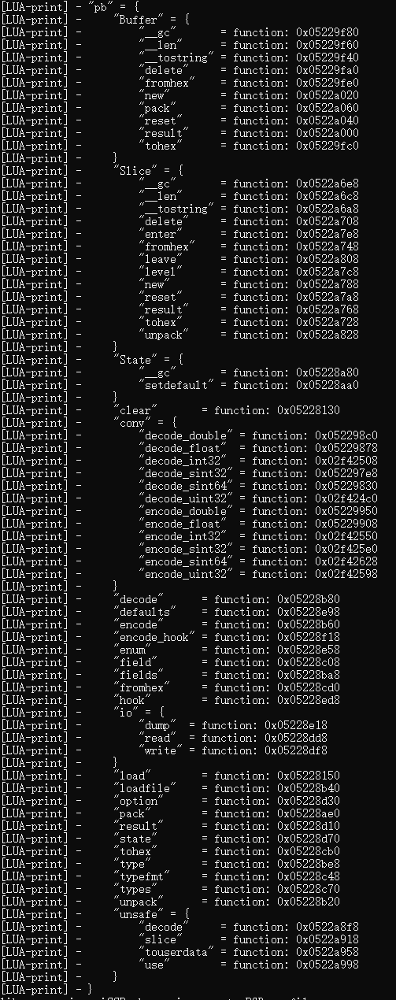
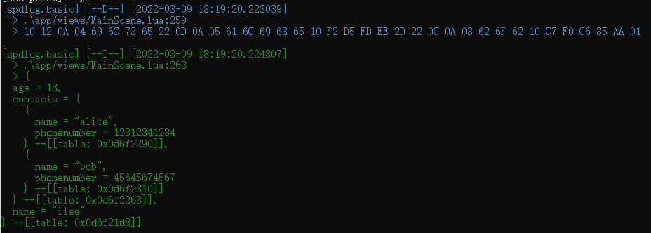

# Cocos2d-x 接入 lua-protobuf

## 一、介绍

最近回顾了一下之前做过的项目，发现 `protobuf` 库使用的是 [云风的 pbc](https://github.com/cloudwu/pbc)，这个库已经很长时间没更新了，而且不支持 `protobuf3`，存在版本兼容问题。于是上 Github 找替代方案，就找到了我们要介绍的主角：**[lua-protobuf](https://github.com/starwing/lua-protobuf)**。

按照官方说法：

    本项目提供在 Lua 全版本（5.1+、LuaJIT）下的protobuf 2/3 版本支持。提供了高级的消息编码/解码接口以及底层的protobuf wireformat 二进制数据操作接口。

    使用高级接口，你需要通过 pb.load() 接口导入 protobuf 的消息描述文件（schema文件，.proto后缀名）的二进制版本（本质上是schema文件通过官方的 FileDescriptorSet 编码得到的二进制pb消息），导入的信息被存储在称为“state”的内存数据库中供消息编码/解码使用。你也可以通过pb模块提供的一系列接口来读取这个数据库里的内容。

    要使用底层接口，你需要使用下面几个库提供的功能：

    pb.slice：读取二进制的wireformat信息。
    pb.buffer：写入二进制wireformat信息。
    pb.conv：在Lua的数字类型和protobuf提供的一众数字数据类型之间转换。
    pb.io：用于将pb模块用于工具当中使用：通过标准输入输出流读取写入二进制消息。

    另外，为了得到schema文件的二进制版本（一般后缀名是.pb的文件），你需要官方protobuf项目提供的schema编译器二进制protoc.exe工具，如果在你的平台下获得这个工具太麻烦，或者你希望能有一个小体积的protobuf编译工具，你可以使用项目自带的另一个独立的纯 Lua库：protoc.lua文件。该文件提供了纯Lua实现的schema文件编译器，并集成了通过调用pb.load()载入编译结果的方便接口。但是要注意因为这个库是纯Lua实现的，它编译的速度会非常慢，如果你的schema文件太大或者编译的时候遇到了性能瓶颈。还是推荐你通过protoc.exe或者在开发时利用pb库自己写脚本将schema编译成.pb文件供生产环境使用。

可以说是，相当之方便了。

## 二、接入

官方中文文档中，有 Urho3d、xLua、Unreal SLua、Unreal UnLua、ToLua 的集成说明，就是没有 Cocos2d-x（作为主流中的非主流游戏引擎，真的是令人扼腕痛惜啊），那我就来试一下吧，反正也没什么损失。

首先，按照惯例，先把项目 [clone](https://github.com/starwing/lua-protobuf) 下来。

接着，分析项目，因为 **lua-protobuf** 是纯 C 实现的，所以很简单，只要把 `pb.h/pb.c` 加入编译就好了。

然后，就是做个 `lua binding`，把接口导出给 Lua，结果你会发现 `pb.c` 已经给我们做好了，我们只需要把它注册到环境中即可。

```c
// lua_protobuf.h
#pragma once

#if __cplusplus
extern "C" {
#endif

#include "lauxlib.h"

#ifndef LUA_PROTOBUF_API
#define LUA_PROTOBUF_API extern
#endif

LUA_PROTOBUF_API int luaopen_pb(lua_State *L);
LUA_PROTOBUF_API int luaopen_pb_io(lua_State *L);
LUA_PROTOBUF_API int luaopen_pb_conv(lua_State *L);
LUA_PROTOBUF_API int luaopen_pb_buffer(lua_State *L);
LUA_PROTOBUF_API int luaopen_pb_slice(lua_State *L);
LUA_PROTOBUF_API int luaopen_pb_unsafe(lua_State *L);

void lua_module_register_lua_pb(lua_State *L);

#if __cplusplus
}
#endif

// ----------------------------------------------------
// lua_protobuf.c
#include "lua_pb.h"

#if __cplusplus
extern "C" {
#endif

void lua_module_register_lua_pb(lua_State * L)
{
	luaopen_pb(L);
	luaopen_pb_io(L);
	luaopen_pb_conv(L);
	luaopen_pb_buffer(L);
	luaopen_pb_slice(L);
	luaopen_pb_unsafe(L);
}

#if __cplusplus
} // extern "C"
#endif
```

最后在 `AppDelegate.cpp` 中引入 `lua_protobuf.h`，调用 `lua_module_register_lua_pb(L)` 注册即可。

然而，事情没有这么简单。编译通过之后，你会发现，根本找不到我们注册的 pb 模块。这是因为 **lua-protobuf**中注册模块使用的是`luaL_newlib`，它是 lua5.2 之后才支持的语法，因此需要转换为 `luaL_register`。

```c
static void register_lua_lib(lua_State* L, const char* name, luaL_Reg* libs) {
	if (LUA_VERSION_NUM < 502)
	{
		luaL_register(L, name, libs);
	}
	else {
		luaL_newlib(L, libs);
	}
}
```

于是可以修改 pb.c 的导出接口：

```c
LUALIB_API int luaopen_pb(lua_State *L) {
	// **
	register_lua_lib(L, "pb.State", meta);
	register_lua_lib(L, "pb", libs);
    // **
}

LUALIB_API int luaopen_pb_io(lua_State *L) {
	// **
	register_lua_lib(L, "pb.io", libs);
    // **
}

LUALIB_API int luaopen_pb_conv(lua_State *L) {
	// **
	register_lua_lib(L, "pb.conv", libs);
    // **
}

LUALIB_API int luaopen_pb_buffer(lua_State *L) {
	// **
	register_lua_lib(L, "pb.Buffer", libs);
    // **
}

LUALIB_API int luaopen_pb_slice(lua_State *L) {
	// **
	register_lua_lib(L, "pb.Slice", libs);
    // **
}

LUALIB_API int luaopen_pb_unsafe(lua_State *L) {
	// **
	register_lua_lib(L, "pb.unsafe", libs);
    // **
}
```

再次编译，然后在 Lua 层打印 pb，得到：



## 三、测试

测试直接使用官方案例，将 `print` 换成 `spdlog`，这样看的更清楚一点，如下：

```lua
local pb = require("pb")
local protoc = require "app.libs.protoc"
local serpent = require "app.libs.serpent"

-- 直接载入schema (这么写只是方便, 生产环境推荐使用 protoc.new() 接口)
assert(protoc:load [[
	message Phone {
		optional string name        = 1;
		optional int64  phonenumber = 2;
	}
	message Person {
		optional string name     = 1;
		optional int32  age      = 2;
		optional string address  = 3;
		repeated Phone  contacts = 4;
	} ]])

-- lua 表数据
local data = {
	name = "ilse",
	age  = 18,
	contacts = {
		{ name = "alice", phonenumber = 12312341234 },
		{ name = "bob",   phonenumber = 45645674567 }
	}
}

-- 将Lua表编码为二进制数据
local bytes = assert(pb.encode("Person", data))
Logger.basic:debug(pb.tohex(bytes))

-- 再解码回Lua表
local data2 = assert(pb.decode("Person", bytes))
Logger.basic:info(serpent.block(data2))
```

查看结果：



完美！

---

🤠 如果你喜欢这篇文章，请给我一个[Star](https://github.com/DoooReyn/cocos2d-x-lua-protobuf)⭐吧!
